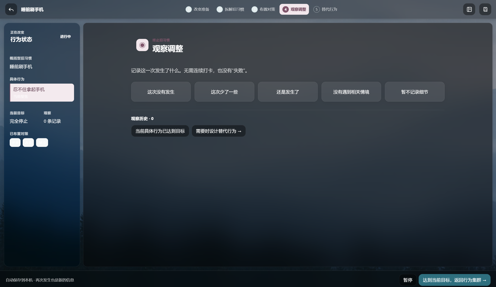
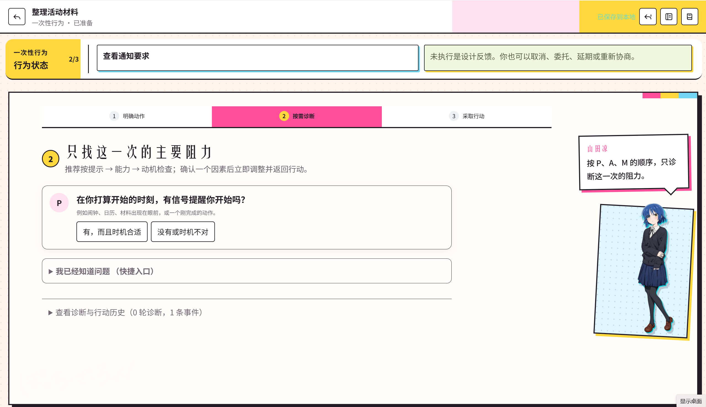

# 福格行为实验室

本项目用于辅助学习 B.J. 福格的《福格行为模型》，并把书中的方法转化为可以反复实践的本地工具。软件能带领用户设计长期微习惯、推动一次性行为，以及减少或终止旧习惯；它是学习与实践的辅助工具，不能替代原书。

如果对软件中的概念、步骤或术语不清楚，建议继续阅读仓库随附的原书 PDF、Markdown 全文、分章资料和提炼笔记。软件刻意保持提示精炼，完整背景、案例和论证仍应以原书及相关学习资料为准。

[下载最新版](https://github.com/cu616/Learning_the_Fogg_Behavior_Model/releases/latest) · [查看更新日志](CHANGELOG.md)

## 可以用它做什么

- **培养新习惯**：按照七步行为设计流程，从愿望、行为探索和黄金行为，一直走到微习惯、提示、庆祝和实践调整。
- **推动一次性行为**：先明确下一步动作，再按需检查提示、能力和动机，找到此刻能做的调整。
- **减少或停止旧习惯**：拆解具体情境，布置 P / A / M 对策，记录观察结果，并在需要时设计替代行为。
- **保存完整过程**：管理多个项目，保留配方版本、实践感受、诊断历史和个人灵感库。

Windows 和 Android 使用相同的行为模型与数据结构。两台设备不会自动同步，可以通过 JSON 导出和导入迁移数据。

## 下载与安装

打开 GitHub 的 [Releases 页面](https://github.com/cu616/Learning_the_Fogg_Behavior_Model/releases/latest)，在 **Assets** 中选择适合自己设备的文件：

| 文件名 | 用途 |
|---|---|
| `Fogg-Behavior-Lab-v0.3.0-windows-x64-setup.exe` | Windows 10/11 x64 离线安装包，适合长期安装使用 |
| `Fogg-Behavior-Lab-v0.3.0-windows-x64-portable.exe` | Windows 10/11 x64 便携版，下载后可直接运行 |
| `Fogg-Behavior-Lab-v0.3.0-android-arm64.apk` | Android 7.0 及以上 ARM64 手机安装包 |

Windows 可能显示“未知发布者”，Android 可能要求允许安装未知来源应用。发行文件的 SHA-256 和签名信息记录在对应的 GitHub Release 中。

## 两种界面主题

专业模式是默认界面，使用森林背景和深色半透明工作面。孤独摇滚模式沿用同一套功能与数据，用漫画式排版、乐队配色和角色提示重新呈现页面。

<table>
  <tr>
    <td width="50%"></td>
    <td width="50%"></td>
  </tr>
  <tr>
    <td align="center">专业模式</td>
    <td align="center">孤独摇滚模式</td>
  </tr>
</table>

打开 **数据与外观 → 界面主题**，可以随时切换主题。专业模式还支持导入本机 JPG、PNG 或 WebP 图片作为背景，之后也能恢复默认森林图。主题选择和自定义背景都只保存在当前设备。

孤独摇滚主题由 [@Praying1213](https://github.com/Praying1213) 创作并贡献，主项目在合并时保留了协作者的 Git 提交历史。主题资源的来源与使用边界见 [素材说明](app/public/themes/kessoku/README.md)。

## V0.3 更新

V0.3 将专业模式与孤独摇滚模式合并进同一个软件，并继续提供 Windows 便携版、Windows 离线安装包和 Android ARM64 APK。两种主题共用长期习惯、一次性行为和终止旧习惯三套工作流，切换主题不会改变已经保存的数据。

当前版本和以往版本的变化统一记录在 [更新日志](CHANGELOG.md) 中。

## 学习资料

仓库附带原书 PDF、整本 Markdown 全文、分章资料和页级索引。软件中的提示有意保持简短；遇到不清楚的概念，可以回到这些资料查看原书案例和完整论述。

- [原书 PDF](source/福格行为模型.pdf)
- [整本检索文本](knowledge/福格行为模型-全文.md)
- [分章资料](knowledge/chapters)
- [福格模型提示笔记](docs/福格行为模型-右侧提示笔记.md)

## 技术实现

桌面端和移动端共用一套业务代码。React 负责界面与三类行为工作流，前端通过 Tauri 命令调用 Rust 后端，Rust 使用 rusqlite 读写本地 SQLite 数据库。

- Tauri 2、React 19、TypeScript、Vite
- Rust、rusqlite（bundled SQLite）
- schema v7，共 33 张业务表
- 数据导出格式 `fogg-lab-export-v4`
- Windows 10/11 x64 与 Android 7.0+ ARM64

Windows 数据保存在 `%APPDATA%\com.fogg.lab\`，Android 数据位于应用私有目录。两个平台不会自动同步，可以通过完整 JSON 导出和导入迁移数据。Android 应用不声明 `INTERNET` 权限；Windows 安装包内含 WebView2 离线运行库。

专业模式和孤独摇滚模式共用页面组件、Rust 命令与数据库。动漫主题通过独立 CSS 和本地图片按需装载，切换时不会创建另一套项目数据。

## 仓库结构

```text
Learning_the_Fogg_Behavior_Model/
├─ app/                         Windows 与 Android 共用应用工程
│  ├─ src/                     React 界面、主题与三类工作流
│  ├─ src-tauri/src/           Rust 后端和 SQLite 命令
│  ├─ src-tauri/migrations/    数据库迁移 001～007
│  └─ src-tauri/gen/android/   Android Gradle 工程骨架
├─ docs/                        蓝图、ADR、实现记录和发布说明
├─ knowledge/                   全文、分章资料与结构化参考库
├─ scripts/                     知识提取和 Android 构建脚本
├─ source/                      原书 PDF
├─ DESIGN.md                    界面设计规范
└─ CHANGELOG.md                 历次版本更新
```

## 开发与构建

Windows 开发与测试：

```powershell
Set-Location app
./dev.bat
./build.bat test
./build-app.bat   # Windows 便携 EXE
./release.bat     # Windows x64 离线安装包
```

Android 需要 JDK 17、Android SDK、NDK 27 和 Rust Android ARM64 目标。环境安装、APK 构建与 USB 安装步骤见 [Android 版构建与安装](docs/implementation/Android版构建与安装.md)。发布 EXE 必须通过 Tauri 构建，具体原因和发行目录见 [应用工程说明](app/README.md)。

## 文档入口

准备参与开发时，从下面几份文档开始：

- [文档索引](docs/README.md)
- [应用工程与构建说明](app/README.md)
- [软件大纲蓝图](docs/blueprints/软件大纲蓝图.md)
- [界面设计规范](DESIGN.md)
- [Agent 协作规则](AGENTS.md)
